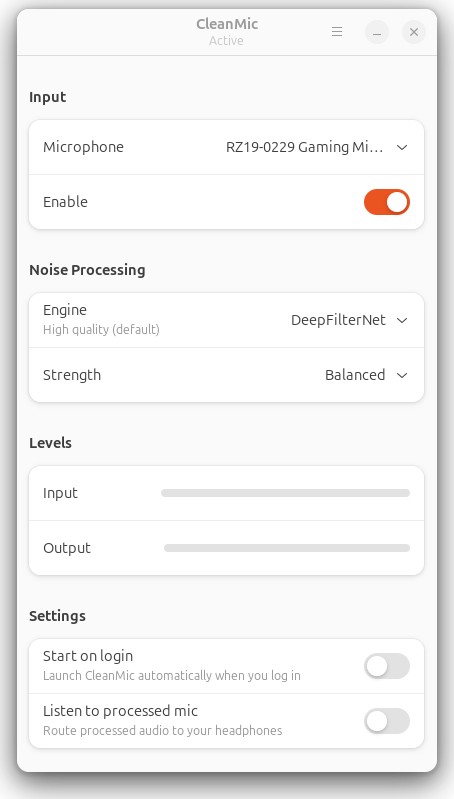

<p align="center">
  
</p>

<h1 align="center">CleanMic</h1>

<p align="center">Noise-free virtual microphone for Linux. It's dead simple: select your mic, enable CleanMic, and every app on your system hears clean audio. Enable it and forget about it.</p>

<p align="center">
  
</p>

## Features

- **Three noise suppression engines** with pre-tuned defaults:
  - **DeepFilterNet** (default) - modern neural model, high-quality output
  - **RNNoise** - lightweight classic RNN denoiser, low CPU
  - **Khip** - adaptive model (user-supplied library)
- **Light / Balanced / Strong strength dropdown** - tuned per-engine against real noise (fan, keyboard, mouse); each step is a distinct audible change on all three engines
- Works with any app through a PipeWire virtual microphone source (Teams, Meet, Discord, Zoom)
- System tray integration with quick enable / disable
- Monitor - route processed mic back to your headphones when you want to hear what the app hears

## Download

1. Go to [**Releases**](https://github.com/claude-gagne/CleanMic/releases/latest)
2. Download `CleanMic-x86_64.AppImage`
3. Make it executable and run:

    ```bash
    chmod +x CleanMic-x86_64.AppImage
    ./CleanMic-x86_64.AppImage
    ```

> Thanks for trying CleanMic. If it's useful to you, you can [sponsor on GitHub](https://github.com/sponsors/claude-gagne) or [buy a coffee](https://buymeacoffee.com/claudegagne).

## System Requirements

- Linux x86_64 with **PipeWire** (Ubuntu 22.04+, Fedora 34+)
- **GTK4 + libadwaita** (installed by default on GNOME desktops)

## Known Limitations

- **PipeWire only** - PulseAudio is not supported
- **Linux only** - no Windows or macOS
- **Khip engine is optional** - requires a user-supplied library, not bundled

## Building from Source

```bash
# Install build dependencies (Ubuntu/Debian)
sudo apt install libgtk-4-dev libadwaita-1-dev libpipewire-0.3-dev pkg-config gettext

# Build
make build

# Build AppImage
make appimage
```

## Support

CleanMic is built in the hours around a day job. If it helps you out, you can help keep it maintained:

- [GitHub Sponsors](https://github.com/sponsors/claude-gagne)
- [Buy Me a Coffee](https://buymeacoffee.com/claudegagne)

No paywalled features. No ads. No nagware in the app. Ever.

## License

MIT
