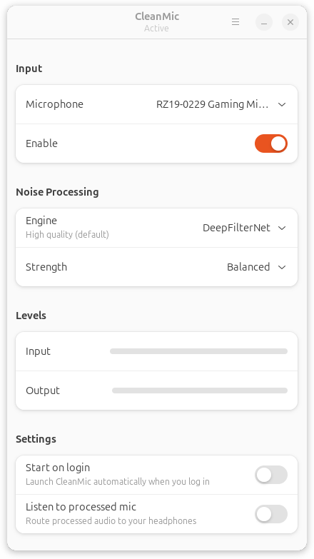

<p align="center">
  
</p>

<h1 align="center">CleanMic</h1>

<p align="center">Noise-free virtual microphone for Linux. It's dead simple: select your mic, enable CleanMic, and every app on your system hears clean audio. Enable it and forget about it.</p>

<p align="center">
  <a href="https://github.com/claude-gagne/CleanMic/releases/latest"></a>
  <a href="LICENSE"></a>
  <a href="https://github.com/claude-gagne/CleanMic/actions/workflows/release.yml"></a>
</p>

<p align="center"><strong>Runs fully offline.</strong> No network, no accounts, no telemetry — your audio never leaves your machine.</p>

## Demo

A public-domain voice over fan noise, then over keyboard typing, with CleanMic off and then on — recorded from the app at mid strength.

<video src="https://github.com/claude-gagne/CleanMic/raw/master/assets/demo/cleanmic-demo.webm" controls muted width="640">
  Your browser can't play the embedded video —
  <a href="https://github.com/claude-gagne/CleanMic/raw/master/assets/demo/cleanmic-demo.webm">download the demo clip</a> instead.
</video>

## Features

- **Three noise suppression engines** with pre-tuned defaults:
  - **DeepFilterNet** (default) - modern neural model, highest quality
  - **RNNoise** - lightweight classic RNN denoiser, lowest CPU
  - **Khip** - adaptive model (user-supplied library)
- **Light / Balanced / Strong strength dropdown** - tuned per-engine against real noise (fan, keyboard, mouse); each step is a distinct audible change on all three engines
- Works with any app through a PipeWire virtual microphone source (Teams, Meet, Discord, Zoom)
- System tray integration with quick enable / disable
- Monitor - route processed mic back to your headphones when you want to hear what the app hears
- **Crash recovery** - automatically reconnects and rebuilds the virtual mic; survives suspend/resume and PipeWire restarts without losing your setup

## Download

1. Go to [**Releases**](https://github.com/claude-gagne/CleanMic/releases/latest)
2. Download `CleanMic-x86_64.AppImage`
3. Make it executable and run:

    ```bash
    chmod +x CleanMic-x86_64.AppImage
    ./CleanMic-x86_64.AppImage
    ```

## System Requirements

- x86_64 Linux with **PipeWire** and **glibc ≥ 2.39**
- **GTK4 + libadwaita** (standard on GNOME; install `libadwaita-1-0` on KDE / XFCE / Cinnamon desktops)

**Tested on:** Ubuntu 24.04 LTS, Ubuntu 26.04 LTS, Fedora 44, and EndeavourOS (Arch-based, rolling).

**Should also work on Ubuntu 24.04+ flavors** (same base, not directly tested): Kubuntu, Xubuntu, Ubuntu MATE, Pop!_OS, Linux Mint 22, elementary OS 8, KDE Neon.

Other modern Linux distros (Debian 13, Bazzite, openSUSE Tumbleweed, etc.) with glibc ≥ 2.39, PipeWire, GTK4 and libadwaita should also work — untested from my end. Feedback welcome.

**Won't run on** glibc < 2.39 — including Ubuntu 22.04, Mint 21.x, Pop!_OS 22.04, Fedora ≤ 39, Debian 12, and RHEL / Alma / Rocky 9.

## How It Works

CleanMic is two cooperating parts:

- A **background audio service** owns a virtual "CleanMic" PipeWire source and routes your physical microphone through exactly one active suppression engine, normalizing sample rate and handling bypass, crash recovery, and persistence.
- A **thin GTK4 + libadwaita window** gives you the engine selector, strength dropdown, device picker, and live input/output level meters.

<p align="center">
  
</p>

## Using Khip

The Khip engine is user-supplied — CleanMic does not ship the library. To enable Khip:

1. Copy `libkhip.so` into a directory CleanMic searches:

    ```bash
    cp libkhip.so ~/.local/lib/
    ```

    CleanMic searches (in order): `~/.local/lib`, `/usr/local/lib`,
    `/usr/local/lib64`, `/usr/lib`, `/usr/lib/x86_64-linux-gnu`, and
    `/usr/lib64`. `~/.local/lib` is the recommended target because it
    requires no `sudo` and works on every distro. For a system-wide
    install, use `/usr/lib64/` on RPM distros (Fedora, openSUSE, RHEL,
    Rocky, Alma) or `/usr/lib/` on Debian-family distros (Debian, Ubuntu).

2. CleanMic auto-detects within ~1.5 seconds — no relaunch needed.
   The "Khip (not installed)" row in the engine selector flips to
   plain "Khip" and becomes selectable.

## FAQ

**Does CleanMic send my audio anywhere?**
No. CleanMic runs fully offline — no network, no accounts, no telemetry. Audio is processed locally and never leaves your machine.

**Does it survive suspend/resume and PipeWire restarts?**
Yes. CleanMic has crash recovery: it automatically reconnects and rebuilds the virtual microphone after your machine wakes up or after PipeWire restarts, so you don't have to re-enable it.

**Which engine should I pick, and how heavy is it?**
Think in lanes, not numbers. **RNNoise** is the lightweight lane for the smallest CPU footprint; **DeepFilterNet** is the quality lane for the cleanest neural suppression. Both are comfortable on a normal laptop during a call.

**Does it work with PulseAudio?**
No — CleanMic is PipeWire only.

**Is there a Windows or macOS build?**
No. CleanMic is Linux only.

**Do I need the GNOME tray/AppIndicator extension?**
No. CleanMic has a real application window, so it works whether or not you have a tray extension. The tray icon is optional convenience.

## Troubleshooting

### Khip row stays grayed after copying `libkhip.so`

Run CleanMic with logging enabled and grep for the discovery message:

```bash
RUST_LOG=info ./CleanMic-x86_64.AppImage 2>&1 | grep -i khip
```

The line `Khip library not found in any of: ...` confirms CleanMic
did not see the library — re-check that `libkhip.so` (not
`libkhip.so.0` or a versioned symlink) is at one of the six search
paths: `~/.local/lib`, `/usr/local/lib`, `/usr/local/lib64`,
`/usr/lib`, `/usr/lib/x86_64-linux-gnu`, or `/usr/lib64`.

### `deep_filter_ladspa | Underrun detected` warnings at `RUST_LOG=info`

When DeepFilterNet is the active engine and you run with
`RUST_LOG=info`, you may see lines like:

```
WARN  deep_filter_ladspa | Underrun detected (RTF: 1.63). Processing too slow!
INFO  deep_filter_ladspa | Increasing processing latency to 10.0ms
```

This is expected log output from the DeepFilterNet LADSPA
plugin's dynamic-latency-manager, not a CleanMic bug. The plugin
starts at 0ms latency, bumps by 10ms on a single-frame underrun to
self-heal, and retries dropping back down every ~10s until it finds
the lowest sustainable latency for your hardware. Audible impact is
roughly one frame (~10ms) per event — imperceptible on voice calls.
Same upstream behavior since DeepFilterNet v1.0.0.

## Building from Source

```bash
# Install build dependencies (Ubuntu/Debian)
sudo apt install libgtk-4-dev libadwaita-1-dev libpipewire-0.3-dev pkg-config gettext

# Build
make build

# Build AppImage
make appimage
```

### Testing

- `make test` — the Rust unit/integration test suite (`cargo test --all-features`).
- `make harness-test` — offline checks for the silent E2E test harness itself
  (shell syntax, a sandboxed self-test of the screen/scale/owner-process
  guards, and the Python metric/report unit tests). No X server, no
  PipeWire, no network.
- `make e2e-audio` — a real, **silent** end-to-end audio test: a nested
  Xephyr display plus a virtual test microphone (no sound reaches your
  speakers, and it never touches your real CleanMic or its config). Runs the
  `baseline` scenario by default; pass `SCENARIOS="baseline swaps toggle
  modes dc autogain"` (or `all`) for the full suite. Writes a Markdown
  report to `target/e2e-audio/<timestamp>/report.md`.
- `make nested-run` / `make nested-stop` — start/stop the same nested
  CleanMic session by hand, for manual poking.

See `scripts/e2e/README.md` for the full safety model, scenario list,
thresholds, and exit codes.

## Support

CleanMic is built in the hours around a day job. If it helps you out, you can [buy me a coffee](https://buymeacoffee.com/claudegagne) to help keep it maintained.

No paywalled features. No ads. No nagware in the app. Ever.

## License

MIT

## Credits

CleanMic stands on excellent open-source work:

- **[RNNoise](https://github.com/xiph/rnnoise)** via the pure-Rust **[nnnoiseless](https://github.com/jneem/nnnoiseless)** port — the lightweight suppression lane.
- **[DeepFilterNet](https://github.com/Rikorose/DeepFilterNet)** — the neural quality lane.
- **[PipeWire](https://pipewire.org/)** — the audio graph and virtual source that make the clean mic possible.
- **[GTK4](https://www.gtk.org/) + [libadwaita](https://gitlab.gnome.org/GNOME/libadwaita)** — the application window and GNOME design language.
- **[ksni](https://github.com/iovxw/ksni)** — the StatusNotifierItem system-tray integration.

The **Khip** engine is supported as a user-supplied backend; its library is not bundled or redistributed.

See [THIRD-PARTY-LICENSES.md](THIRD-PARTY-LICENSES.md) for the full license text and provenance record of the third-party binary CleanMic bundles (the DeepFilterNet LADSPA plugin).

**Demo audio** — the before/after demo uses real recordings under CC0 / public domain:

- Speech — [*Hans Brinker* (LibriVox), chapter 1, read by Mark F. Smith](https://archive.org/details/hans_brinker_mfs_librivox) — public domain
- Fan noise — [*SSE Library: MACHINES* (USC Cinema / Sunset Editorial, via the Internet Archive)](https://archive.org/details/SSE_Library_MACHINES) — CC0 1.0
- Keyboard typing — [*"399603 dustin-davis typing"* by Dustin_Davis (Wikimedia Commons)](https://commons.wikimedia.org/wiki/File:399603_dustin-davis_typing.wav) — CC0 1.0
